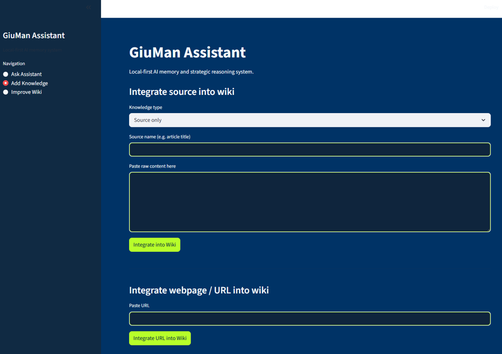
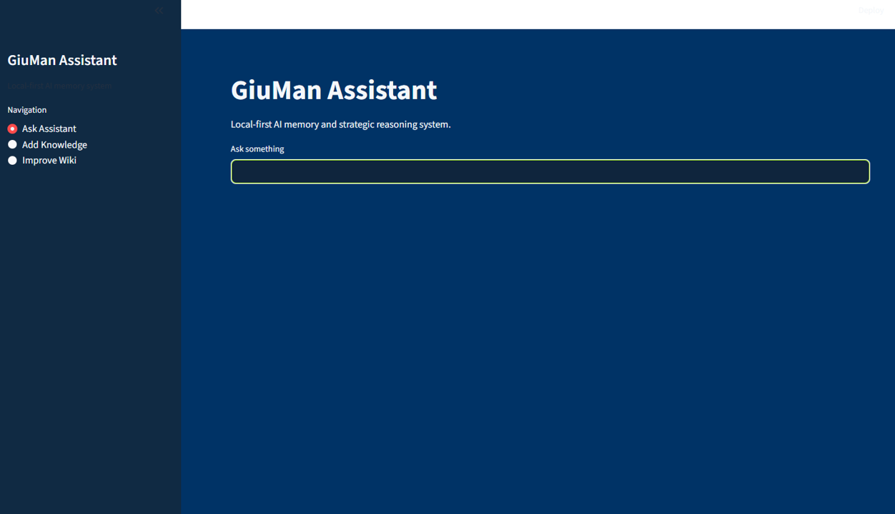

# Giuman Assistant

Giuman Assistant is a local-first personal knowledge assistant.

It helps capture notes, structure them into a private markdown wiki, and ask questions over that curated knowledge base.

The current MVP focuses on a simple flow:

1. Import notes from AINOTE2 PDF exports
2. Extract structured information from the notes
3. Store original files and raw extracted text locally
4. Integrate useful content into a markdown wiki
5. Build a local retrieval index
6. Ask questions over the curated wiki

---

## Current MVP

The MVP includes:

* A Streamlit app for asking questions and adding knowledge
* A CLI importer for AINOTE2 PDF/image exports
* Structured extraction of handwritten or exported notes
* A markdown wiki as the source of truth
* A local ChromaDB retrieval index
* OpenAI-based extraction, summarisation, and reasoning
* Local/private folders excluded from GitHub

The system is intentionally simple. It is not a production platform, a multi-agent framework, or a public cloud service.

---

## Core Idea

Most note-taking tools store information.

Giuman Assistant is designed to help turn notes into reusable knowledge.

The intended flow is:

```text
Sources → Extraction → Structured Capture → Wiki → Retrieval → Answer
```

Where:

* **Sources** are PDFs, notes, images, URLs, or manually pasted text
* **Extraction** converts source material into structured text
* **Structured Capture** separates facts, entities, topics, actions, summaries, and uncertain text
* **Wiki** stores curated knowledge in markdown files
* **Retrieval** selects relevant wiki context
* **Answering** uses the selected context to respond to questions

---

## AINOTE2 Workflow

AINOTE2 exports are stored locally in:

```text
AINOTE2_inbox/raw/
```

Run the importer with:

```bash
python -m scripts.import_inbox
```

The importer:

* scans the inbox for new PDF/image files
* skips duplicates using `manifest.json`
* renders PDF pages as images
* extracts structured note content
* stores raw extracted content locally
* updates the markdown wiki
* reindexes the local retrieval database

The extraction currently produces sections such as:

```text
METADATA
ENTITIES
TOPICS
EXACT_TRANSCRIPTION
STRUCTURED_CAPTURE
WIKI_SUMMARY
ACTIONS
UNCERTAIN_TEXT
```

This makes the output easier to inspect, clean, and reuse.

---

## Local Folder Model

The project separates code from private runtime data.

These folders are local/private and should not be committed:

```text
AINOTE2_inbox/   Original AINOTE2 exports and import manifest
raw/             Raw extracted source text
wiki/            Private curated markdown knowledge base
db/              Local ChromaDB retrieval index
notes/           Local notes, if used
.env             Local API keys and secrets
```

Example files can be committed separately under an example folder, such as:

```text
examples/
```

For example:

```text
examples/manifest.example.json
examples/wiki_example.md
examples/raw_note_example.md
```

---

## Recommended `.gitignore`

Use this pattern to keep private/runtime data out of GitHub:

```gitignore
# Python
.venv/
__pycache__/
*.pyc

# Secrets
.env

# IDE
.idea/

# OS
.DS_Store
Thumbs.db

# Runtime data
db/
raw/
wiki/
notes/

# OneDrive / local inbox
AINOTE2_inbox/

# Temporary
z_deleteme/
```

If you want to show examples publicly, commit them under:

```text
examples/
```

Do not commit your real `manifest.json`, raw PDFs, private wiki, or local database.

---

## Installation

Clone the repository:

```bash
git clone https://github.com/GiuseppeManai/GiumanAssistant.git
cd GiumanAssistant
```

Create and activate a virtual environment.

Windows PowerShell:

```powershell
python -m venv .venv
.venv\Scripts\activate
```

Install dependencies:

```bash
pip install -r requirements.txt
```

Create a local `.env` file:

```env
OPENAI_API_KEY=your_key_here
OPENAI_MODEL=gpt-4o-mini
```

---

## Run the App

Start the Streamlit app:

```bash
streamlit run run.py
```

The app currently supports:

* asking questions over the local wiki
* adding manual knowledge
* importing URL/text content
* improving wiki pages
* viewing retrieved sources

---

## Import AINOTE2 Notes

Place exported AINOTE2 files in:

```text
AINOTE2_inbox/raw/
```

Supported file types include:

```text
.pdf
.png
.jpg
.jpeg
```

Run:

```bash
python -m scripts.import_inbox
```

After import, the system updates the local wiki and retrieval index.

---

## Reindex the Wiki

If you manually edit wiki files, rebuild the local index:

```bash
python -m scripts.reindex_wiki
```

---

## Reset the Local Index

Windows PowerShell:

```powershell
Remove-Item -Recurse -Force db
python -m scripts.reindex_wiki
```

macOS/Linux:

```bash
rm -rf db
python -m scripts.reindex_wiki
```

---

## Suggested Project Structure

```text
GiumanAssistant/
│
├── giuman_assistant/
│   ├── app.py
│   ├── llm.py
│   ├── memory.py
│   ├── source_store.py
│   └── wiki_manager.py
│
├── scripts/
│   ├── import_inbox.py
│   └── reindex_wiki.py
│
├── examples/
│   └── manifest.example.json
│
├── run.py
├── requirements.txt
├── README.md
└── .gitignore
```

Local-only folders are created when the app/importer runs:

```text
AINOTE2_inbox/
raw/
wiki/
db/
notes/
```

---

## Screenshots

Recommended screenshots for the MVP:

```text
## Screenshots

### Ask Assistant



### Add Knowledge



### Improve Wiki


```

Once added, include them here:

### Ask Assistant

```markdown

```

### Add Knowledge

```markdown

```

### AINOTE2 Import

```markdown

```

### Retrieved Sources

```markdown

```

### Improve Wiki

```markdown

```

---

## Design Principles

Giuman Assistant follows a few simple principles:

1. **Wiki-first memory**
   The markdown wiki is the source of truth.

2. **Local-first storage**
   Notes, raw files, wiki pages, and indexes remain local by default.

3. **Inspectable outputs**
   Extracted content should be readable and easy to correct.

4. **Retrieval before reasoning**
   The assistant should answer using selected wiki context, not hidden memory.

5. **Small system over complex framework**
   The MVP should stay simple, understandable, and easy to modify.

6. **Private data stays private**
   Runtime data, source notes, and local indexes should not be committed to GitHub.

---

## Non-Goals

This MVP is not trying to be:

* a production SaaS product
* a generic agent platform
* a full document management system
* a public website
* a cloud-hosted memory service
* a replacement for security, backup, or access-control tooling

Those can be considered later.

---

## Security Notes

This is a local personal assistant.

Do not expose the Streamlit app publicly unless you add proper security controls, including:

* authentication
* HTTPS
* access control
* secret management
* backup policy
* data retention policy

Keep `.env`, `AINOTE2_inbox/`, `raw/`, `wiki/`, and `db/` private.

---

## Roadmap

Near-term MVP cleanup:

* [ ] Finalise `.gitignore`
* [ ] Remove private runtime files from Git tracking
* [ ] Add example manifest instead of real manifest
* [ ] Add screenshots
* [ ] Keep UI simple
* [ ] Improve README clarity

Later improvements:

* [ ] Configurable assistant name
* [ ] Public-safe example data
* [ ] Optional AINOTE import from UI
* [ ] Better wiki review workflow
* [ ] Better source traceability
* [ ] Public branding cleanup

For now, the local version remains **Giuman Assistant**.

A future public version may expose a configurable assistant name, but the package should not be renamed during MVP cleanup.
